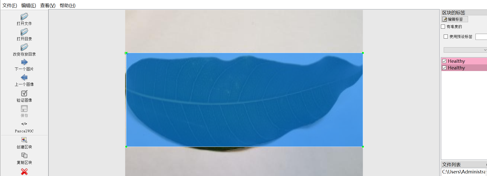
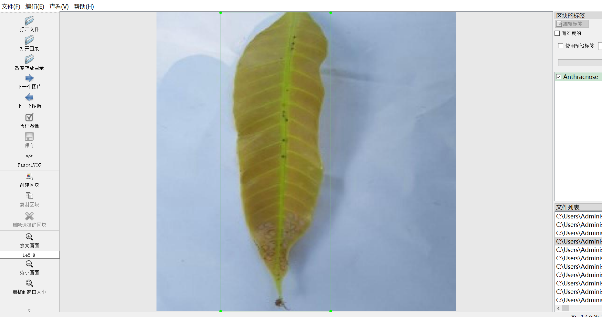
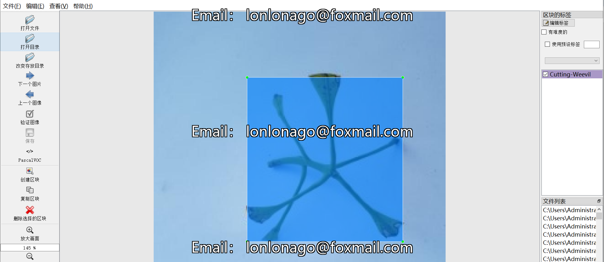
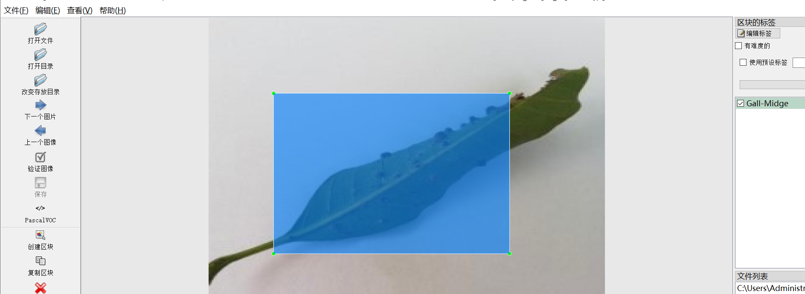
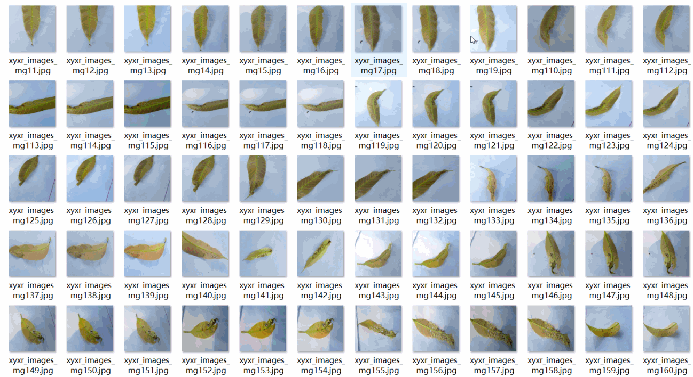

# [Object Detection] Mango Unit Leaf Disease Detection Dataset 2268 imagesYOLO+VOC（containing (Augmented) ）

Dataset Format: VOC format + YOLO format

The compressed file contains: three folders, each storing images, xml files, and text files.

Total jpg images in JPEGImages folder: 2268

The total number of xml files in the Annotations folder is: 2268.

The total number of txt files in the labels folder is 2268.

Number of tag types: 8

Tag names: ["Anthracnose","Bacterial-Canker","Cutting-Weevil","Die-Back","Gall-Midge","Healthy","Powdery-Mildew","Sooty-Mould"]

The number of boxes for each label (Note that the order of labels in the Yolo format does not correspond to this, but is based on the classes.txt file in the labels folder):

Anthracnose frame count = 338

Bacterial-Canker frame count = 333

Cutting-Weevil frame count = 220

Die-Back frame count = 259

Gall-Midge frame count = 289

Healthy frame count = 215

Powdery-Mildew frame count = 315

Sooty-Mould frame count = 302

Total boxes: 2271

Picture clarity (Resolution: Pixels): Clear

Image Enhancement: Yes

Shape of the label: Rectangular box, used for object detection and recognition.

Important Note: None

Special Notice: This dataset does not guarantee the accuracy or precision of the trained models or weight files. The dataset only provides accurate and reasonable annotations.

Annotation example:

Picture overview

## Images

---

Here is a pay link on Stripe (https://buy.stripe.com/3cs8yP7sY87d0vu9AB). Please contact me lonlonago@foxmail.com after funding $89, and I will send you a complete data files, thank you!

